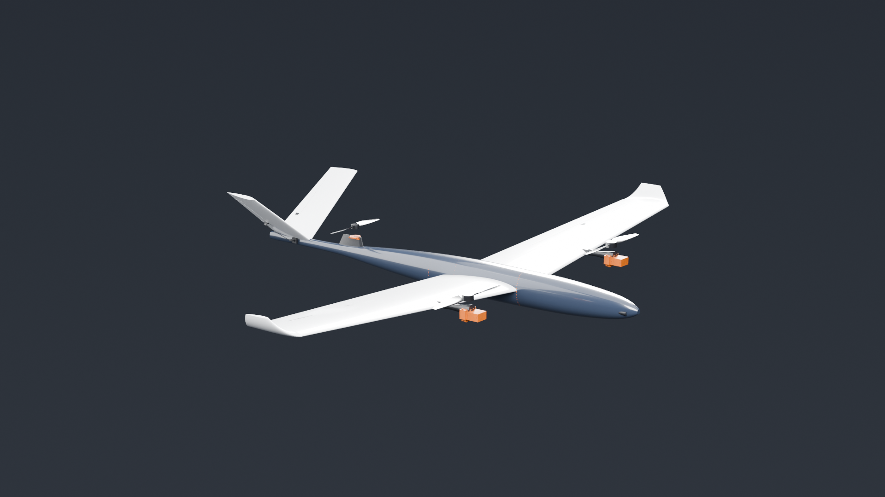
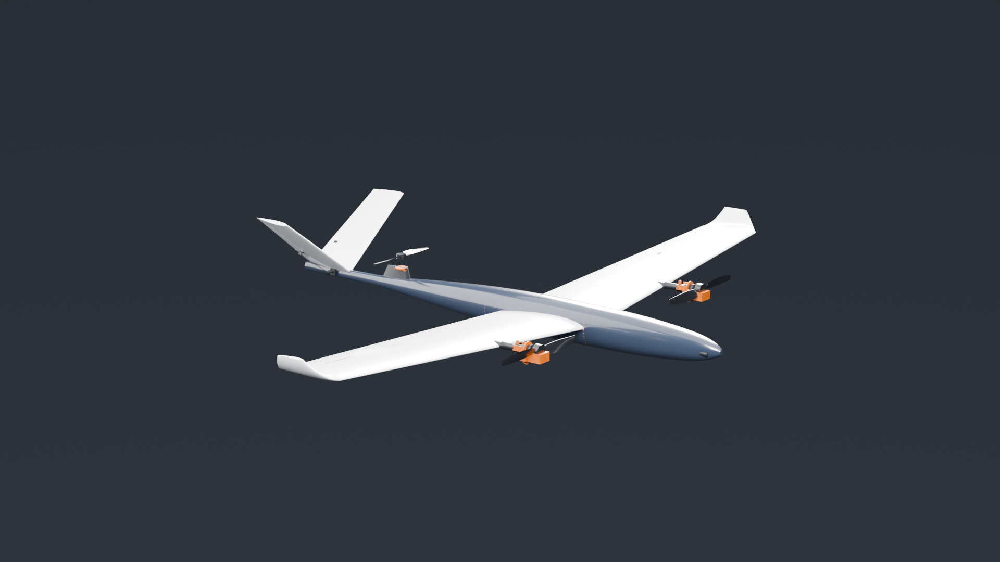

# Tri-Tiltrotor VTOL — PX4 + Gazebo Harmonic



A **three-rotor tilt-rotor VTOL** for PX4 SITL, built to the layout production
aircraft in this class actually use: two tilting rotors on the wing ahead of the
CG, and one **fixed, hover-only lift rotor** on a pylon at a waisted fuselage
station, ahead of a V-tail.

PX4 ships a **quad** tiltrotor (four motors, two of them tilting). This is a
**tri** — one fewer motor, ESC and propeller — and upstream provides no model
for it.

**Why the lift rotor is fixed, not tilting.** A tilting tail rotor keeps
producing thrust in cruise, but it also lays a wake over whatever sits behind
it. A hover-only rotor is stopped in cruise, so the V-tail behind it flies in
clean air in the only regime where tail effectiveness matters for stability.
The fuselage narrows **57%** ahead of the pylon so the rotor draws air already
squeezed clear of most of the boundary layer. The cost is a stopped disc in
cruise — about 1 N against a 3.3 N requirement — which is why the BOM specifies
a **folding** propeller, and why `check()` refuses a fixed rotor without one.

```bash
git clone <this repo> && cd 04-tiltrotor-vtol
bash sim/install_into_px4.sh ~/PX4-Autopilot   # symlink airframe + model
cd ~/PX4-Autopilot && make px4_sitl gz_tri_tiltrotor
# then at the pxh> prompt:
#   commander takeoff
#   commander transition
```

| Hover — rotors up | Cruise — rotors forward |
|---|---|
|  |  |

Both rendered from the **same CAD**, at the two ends of the tilt range. Nothing
was moved by hand: `render/assembly.json` is generated from `cad/params.py`, so
the pictures and the simulator are driven by one set of numbers. The camera is
generated too — it solves its own distance by projecting the aircraft's
bounding box onto the image plane, because a hardcoded camera position is a
latent bug in a parametric project: change the span and a wingtip leaves the
frame silently.

```bash
powershell -File render/render_all.ps1     # 12 renders, ~6 s each on GPU
```

---

## Verified, with numbers

Nothing below is asserted. Each row is produced by a script in `sim/` that you
can re-run.

| Claim | Measurement | How |
|---|---|---|
| Design closes | **118/118** invariants | `cad/params.py` |
| Model is valid | **13/13** | `sim/validate_model.sh` |
| CAD is manufacturable | STEP round-trip **0.000000 mm³** | `cad/gen_nacelle.py` |
| **It hovers** | climbed to **10.071 m** vs 10.0 m commanded | `sim/verify_hover.sh` |
| **It transitions** | both tilting nacelles **0.5° → 89.5°** | `sim/verify_transition.sh` |
| Control surfaces fit the wing | cutter **100.0%** inside the wing solid | `cad/probe_ctrl_fit.py` |
| Every avionics box fits its station | 7 items vs the lofted section | `cad/params.py` |
| ~~It glides~~ | **NOT VERIFIED — see below** | `sim/verify_glide.sh` |

The hover and transition rows were re-measured after the pitch and geometry
corrections: hover reached **10.068 m** against 10.0 m commanded (5/5), and
both tilting nacelles ran **0.0° → 89.6° / 89.5°** with 3/3 rotors turning.

### The glide test does not currently test anything

`sim/verify_glide.sh` was the only script here that tests the **aerodynamic**
model rather than a mechanism, and it is the one that does not work. It is
listed as unverified above rather than quietly dropped.

It commands the descent the polar predicts as an offboard **NED velocity**
setpoint, then measures travel over height lost. Run unattended end to end
(`sim/verify_glide_auto.sh`), the aircraft flies at **35.5 m/s** against a
commanded 14.76, sinking **0.164 m/s** against a predicted 0.941 — an implied
glide ratio of **217** for an airframe whose derived (L/D)max is ~15.

The cause is not the drag model. **PX4 does not act on offboard NED velocity
setpoints in fixed-wing mode**; the setpoint is accepted and ignored, and the
fixed-wing controller holds altitude at its own airspeed. The measurement was
never of a glide. Two things kept this hidden:

- The script's only sanity check was "did it descend at all". Powered
  near-level flight descends slightly, and dividing by a near-zero sink rate
  produces a magnificent glide ratio. There is now a **speed gate**: if ground
  speed exceeds 1.35 × the commanded best-glide speed, it reports powered
  flight instead of a number.
- The line that prints the comparison had a shell-quoting bug that crashed it
  (`g['v_best_glide_ms']` inside a single-quoted shell block ends the string).
  It had never once run, because every previous attempt exited earlier at the
  "not descending" branch. **A test that has never reached its assertion is
  not a passing test.**

The honest position: the drag polar is derived and traceable, and it is
**untested**. Testing it needs a throttle-cut path — commanding zero thrust
directly, or a fixed-wing descent PX4 will actually fly — not a velocity
setpoint.

Nacelle angle through the manoeuvre, read from Gazebo's joint state rather than
from a log line (0° = thrust up, 90° = thrust forward):

```
tilt_left    37.1   0.5   3.1   1.4   3.5   3.7  38.0  89.5  89.5  89.5
tilt_right   37.1   0.5   7.6   5.8   7.9   8.0  41.5  89.6  89.6  89.6
             spawn  ├──── hover ────┤ ├rotating┤ ├─── cruise ───┤
```

The fixed lift rotor is emitted as a `fixed` joint, so it correctly never
appears in this data — and all 3 rotors are confirmed spinning.

⚠️ These numbers were re-measured after the airframe changed.

---

## The aircraft

| | |
|---|---|
| MTOW / span / wing area | 4.64 kg · 2.00 m · 0.520 m² |
| Wing loading · aspect ratio | 8.92 kg/m² · 7.69 (**8.31 effective**, winglets) |
| Airfoil | NACA 2410, taper 0.65, 4° dihedral, −2° washout, winglets |
| Rotor stations from CG | wing **+0.173 m** (tilting), lift rotor **−0.700 m** (fixed) |
| Tail | V-tail at **−0.870 m**, 36.4° dihedral, 0.128 m² |
| Hover trim (solved) | wing 17.79 N each, lift rotor 9.92 N (**21.8%** of lift) |
| Fuselage | 1.55 m, fineness **12.7**, waisted 70% at the pylon |
| Stall → transition → cruise | 11.51 → 14.96 → 19.0 m/s  (measured section) |
| Cruise L/D · best L/D | **13.05** at 19 m/s · **15.04** at 14.46 m/s |
| Unpowered glide | **3.81°**, sink **0.960 m/s** |
| Servos · peak servo current | 4 surface + 2 tilt · **15 A** (needs its own BEC) |
| Payload | 1080p nose camera, 45 g, 78° HFOV, 15° down |

### Why the rotors straddle the CG

A layout with both tilt rotors *behind* the CG cannot be trimmed in hover: total
lift acts aft of the centre of mass and produces an unopposed nose-down moment
of W·L that no combination of thrust and tilt can cancel. Putting rotors on both
sides of the CG is what makes hover pitch controllable, and it is enforced as an
invariant (`rotors straddle the CG`) rather than left to inspection.

### Yaw is single-path, deliberately

The wing pair carries yaw by differential tilt (ArduPilot calls the equivalent
`Q_TILT_TYPE=2`), travelling 15° aft of vertical. The tail nacelle **cannot**
contribute yaw — a centreline force in the x–z plane produces no moment about z
— so it carries pitch instead (`CA_SV_TL2_CT=2`). Yaw authority is 4.96 rad/s²
from wing vectoring alone.

---

## One source of truth

Every dimension lives in [`cad/params.py`](cad/params.py) and nowhere else.
The Gazebo model, the PX4 airframe, the lofted geometry and the printed nacelle
are all *generated* from it, so they cannot drift apart.

```
cad/params.py ──┬─→ gen_sdf.py           → sim/models/tri_tiltrotor/model.sdf
                ├─→ gen_airframe.py      → sim/airframes/4030_gz_tri_tiltrotor
                ├─→ gen_geometry.py      → lofted wing / fuselage / tail /
                │                          control surfaces / booms / props
                ├─→ gen_nacelle.py       → printable cradle, yoke, fit coupon
                ├─→ gen_manifest.py      → render/assembly.json  (Blender)
                ├─→ gen_flight_params.py → sim/ros2/flight_params.json  (ROS 2)
                ├─→ gen_layout.py        → docs/equipment-bay.svg
                ├─→ gen_bom.py           → docs/BOM.csv
                ├─→ gen_cfd_surface.py   → cfd/geometry/  (wetted OML only)
                └─→ gen_cfd_case.py      → cfd/case/      (OpenFOAM)
```

`gen_flight_params.py` exists because the ROS 2 teleop node runs under WSL's
system Python and cannot import `params.py` (Windows-side 3.12 venv with
build123d). Without it the glide speed would have to be retyped into the node
and would drift the moment the polar changed.

## Running it

See [`RUN.md`](RUN.md) — three commands, plus the environment traps that make
the difference between "it works" and "it silently does nothing".

`params.check()` runs 118 invariants in arithmetic *before* any CAD kernel or
simulator starts, and refuses to emit an aircraft that cannot fly. It has
already caught, on real runs:

- a mass budget short by **0.88 kg** (battery folded into "fuselage")
- a horizontal tail sitting **inside the tail rotor's disc**, which would have
  flown in its own wash
- its own bad arithmetic — a bolt-pattern check that double-counted and failed
  a design that was fine

### Six defects this structure caught, and one it didn't

Every one of these passed the invariant suite as it stood. They are listed with
what was wrong, how it was actually found, and what now prevents a repeat —
because "we have 118 checks" is worth nothing next to what the checks missed.

| Defect | Found by | Why the checks missed it |
|---|---|---|
| **Aerofoil built upside down.** `Plane(x_dir=(1,0,0), z_dir=(0,1,0))` has in-plane Y = `(0,0,-1)`, so NACA 2410's camber pointed at the ground on the wing, winglets, tail and propeller blades. | Extruding one root section in isolation: sketch Y `-21.5..+10.2` → model z `-10.2..+21.5` | Nothing inspected the mesh. `LiftDrag` reads coefficients and joint angles, never geometry, so it flew correctly while looking wrong. A first probe read the wing **bounding box** and concluded the opposite — the winglet at +152 mm dominates it. |
| **Wing boom slung under the wing.** Centred 14 mm below the chord line, spanning −22.0…−6.0 mm against a skin at −8.3…+18.4 mm: 13.7 mm proud, applying nacelle load on a lever arm instead of in shear. | Measuring the section at the boom station | The boom's `z` was a literal in `gen_geometry.py` that `params.py` never saw. Now asserted **where the number lives**, not in `check()`. |
| **Control surfaces overlapping the wing.** Built as separate solids while the wing kept its full chord — two solids in one space. | Volume arithmetic: the wing lost 57.5 cm³ to a 478 cm³ cutter | No check compared the surfaces to the wing. Now the surface *is* the wing's own aft portion (`wing ∩ prism`), 100% by construction. |
| **V-tail bolted to nothing.** The body ended at −0.872 m; the tail root chord runs to −1.005 m. 133 mm of a 180 mm root cantilevered into open air. | Reading the station table against the tail chord | The invariant was called *"fuselage is long enough to carry the tail"* and compared **two lengths** (1.35 vs 0.956 m). It never asked where anything was. |
| **Takeoff nose-up.** `CA_ROTOR*_CT` defaults to 6.5 for every rotor; ours are 38 N and 25 N. PX4 asked the tail for 9.32 N and got ~66%, leaving ~2.2 N·m of unopposed nose-up at 0.700 m aft. | PX4's own `module.yaml`: *"Thrust = CT · u²"* | Stock `4020_gz_tiltrotor` omits `CT` too — correctly, because its four rotors are identical and the error is common-mode. Ours are not. |
| **CG 11.2 mm off.** `base_link`'s inertial sat at the origin while five links hung mass elsewhere; every `CA_ROTOR*_PX` is quoted from the CG. | Summing m·x across the emitted SDF | `params.check()` verified the *design* CG arithmetic. Nothing verified that the *generated SDF* put mass where the design said. |
| **BOM had no control-surface servos.** Listed 3 tilt servos, zero aileron or ruddervator servos, while PX4 has allocated four (`CA_SV_CS0..3`) since the V-tail was adopted. | Reading the BOM against the airframe | Nothing cross-checked the parts list against the control allocation. An aircraft built to that list would have had no roll, pitch or yaw in forward flight. |

The pattern worth taking away: **five of the seven were checks whose *name*
claimed a guarantee their *arithmetic* could not deliver.** A check with a
constant on both sides (`3 <= 4`) cannot fail, and cannot help.

### What AVL found, and what it fixed

`cad/gen_avl.py` emits a vortex-lattice model from the same `params.py`;
`aero/run_avl.sh` trims it at the cruise CL. It immediately found two defects,
both now fixed.

**1. The MAC was located as if the wing were rectangular.** The wing is placed
by its **root** quarter-chord, but the aircraft balances about the **mean
aerodynamic** chord — and on a wing with 3° of leading-edge sweep those are not
the same station. The MAC quarter-chord sits **24.4 mm aft** of the root's.
Every call site computed `CG_MAC_FRACTION * WING_CHORD - 0.25 * WING_CHORD`
inline, in **eight separate files**, and all eight placed the root where the MAC
belonged. The whole wing sat 24.4 mm too far aft.

The result: `params.py` printed *"CG at 28% MAC"* while the aircraft actually
had its CG at **18.6% MAC**. The error was invisible because it is in the safe
direction — more nose-heavy, more stable — and because the expression was
duplicated rather than written once.

The fix names the distinction that caused it: `mac_quarter_chord_x()` and
`wing_root_quarter_chord_x()` are now two functions in `params.py`, and nothing
computes either inline. Measured after the fix: **CG at 28.00% MAC.**

**2. The V-tail had no incidence, so the elevator carried the trim.** The
ruddervators sat 8.67° from neutral in cruise, permanently. `params.py` had no
tail incidence parameter at all. `aero/solve_tail_incidence.sh` runs AVL at two
incidences and interpolates to zero elevator — the relationship is linear, so
two runs give it exactly. Answer: **−2.49°**, leading edge down.

| trimmed at cruise CL 0.403 | before | after |
|---|---|---|
| **Static margin** | 28.3% MAC | **19.5%** |
| **Trim elevator** | **−8.67°** | **+0.015°** |
| Induced drag CDind | 0.0068252 | **0.0063360** (−7.2%) |
| Span efficiency (Trefftz) | 1.144 | **1.236** |
| Cm_α | −1.474 | −1.018 |
| Cn_β (yaw stiffness) | 0.0658 | 0.0644 — kept |
| Cmq (pitch damping) | −12.77 | −12.29 — kept |
| Spiral `Clb·Cnr/Clr·Cnb` | 1.065 | **1.127** |

Both axes of authority survived intact, which was the point of fixing the CG
rather than shrinking the tail.

### Why the tail was not resized

The obvious response to 28% static margin is a smaller tail. AVL says no.
Sweeping tail area (`aero/sweep_tail.sh`):

| tail area | SM % | Cmq | Cn_β |
|---|---|---|---|
| 1.00 | 28.3 | −12.77 | 0.0658 |
| 0.70 | 22.1 | −9.11 | 0.0458 |
| 0.50 | 17.9 | −6.73 | 0.0324 |

**Halving the tail buys 10 points of static margin and costs 47% of the pitch
damping and 51% of the yaw stiffness** — and 0.0324 is below the ~0.05 usually
wanted for directional stability. Cmq scales with area × arm², so it falls
faster than the static margin improves; a tail *volume coefficient* cannot see
that, which is exactly the trap the sizing literature warns about.

It also fights itself: removing ~66 g of tail structure 0.870 m aft moves the
CG **12.6 mm forward**, giving back nearly half the margin just bought. And a
V-tail carries pitch and yaw on the *same* surfaces, so shrinking costs both at
once — there is no trade available.

Fixing the CG achieved more, for free.

### Aerodynamics are measured, not guessed

The section coefficients were hand-estimated, then derived from thin-airfoil
theory, and are now **measured** — XFOIL run on NACA 2410 at this aircraft's own
Reynolds numbers (`aero/run_xfoil.sh`, Ncrit 5, because the wing is printed).

| 2-D section | Guessed | Theory | **XFOIL, measured** |
|---|---|---|---|
| CL_α | 5.20 /rad | 6.283 (2π) | **6.022** |
| CL_max | 1.20 | 1.40 | **1.219** |
| CD_min | 0.028 | 0.0069 | **0.00868** |
| Stall α | 15° asserted | 15.5° | **13.18°** |

The measurement is taken at the **converged stall Reynolds number of 199,489**,
which is a fixed point: CL_max sets the stall speed, the stall speed sets the
chord Reynolds number, and that sets CL_max.

**Theory was wrong in the direction that flatters the aircraft, and worst where
it matters.** CL_max was 15% optimistic at exactly the low Reynolds number where
stall happens, and CD_min of 0.0069 turned out to be roughly the *Re 1,000,000*
figure for a wing that never exceeds 393,000. What that cost:

| | before | after |
|---|---|---|
| Stall speed | 10.74 m/s | **11.51 m/s** (+7.2%) |
| Transition speed | 13.96 | 14.96 m/s |
| CD0 (whole aircraft) | 0.02132 | 0.02310 |
| (L/D)max | 15.65 | **15.04** (−3.9%) |

All **118 invariants still pass** — the aircraft still closes, the envelope just
sits 7% higher. One consequence is now decisive rather than marginal: the
minimum-power speed (max endurance for a propeller aircraft) works out at
**0.955 × stall**, i.e. below stall. It is not a speed this aircraft can fly.
Loiter at 1.2 × stall = **13.81 m/s**.

---

## Against what PX4 ships

| | stock `gz_tiltrotor` | this |
|---|---|---|
| Configuration | quad, 2 of 4 tilt | **tri**, 2 tilting + 1 fixed lift |
| Motors / ESCs / props | 4 | **3** |
| Fuselage | one box, 0.55 × 2.144 × 0.05 m | lofted through 15 stations, **waisted** at the pylon |
| Main wing lift surface | **none** — elevons stand in for the wing | per-panel, at computed centres of pressure |
| Wing | rectangular plank | NACA 2410, tapered, dihedral, washout, **winglets** |
| Tail | separate stabiliser + fin | **V-tail**, dihedral derived from required effectiveness |
| Rudder | ±0.01 rad, LiftDrag **commented out** | functional, both ruddervators live |
| Airspeed sensor | absent | present (required to gate transition) |
| Aero coefficients | hand-entered | **derived from the section** |
| Verification | none | 4 scripts, 74 assertions |

---

## Repository layout

```
cad/     params.py + four generators, STEP output
sim/     model, airframe, worlds, and the verification scripts
media/   video masters (generated; see sim/capture_video.sh)
docs/    build notes and the environment gotchas
```

### Scripts

| Script | Does |
|---|---|
| `sim/install_into_px4.sh` | symlinks airframe + model into a PX4 checkout, idempotent |
| `sim/validate_model.sh` | SDFormat validity, structure, headless load |
| `sim/verify_hover.sh` | commands takeoff, measures altitude from Gazebo's pose topic |
| `sim/verify_transition.sh` | reads actual tilt joint angles through the manoeuvre |
| `sim/verify_glide_auto.sh` | PX4 + agent + scripted flight + glide measurement, unattended |
| `sim/capture_video.sh` | headless flight recording, Gazebo → ROS 2 → MP4 |
| `sim/run_gui.sh` | interactive run with the Gazebo GUI |

---

## Pinned versions

Reproducibility is the point; these are the versions it was verified against.

| | |
|---|---|
| PX4-Autopilot | **v1.17.0** |
| Gazebo | **Harmonic, gz-sim 8.11.0** |
| ROS 2 | **Jazzy** (used for the video bridge) |
| Ubuntu | **24.04 noble** (WSL2) |
| build123d | **0.11.1** on Python 3.12 |
| Airframe ID | **4030** `gz_tri_tiltrotor` |

---

## Honest limitations

- **Simulation only.** No physical aircraft exists. Nothing here has been flown
  or wind-tunnel tested, and the nacelle tolerances are verified in CAD only.
- **Aerodynamic coefficients are derived from thin-airfoil theory and published
  section data**, not from CFD or measurement. They are traceable, not exact.
- **Inertia is estimated** from a rod-and-point-mass model, good to perhaps
  ±25%. The control-authority margins are wide enough that this does not change
  any conclusion, but it is an estimate.
- **The transition is verified as "the nacelles rotate through 90° in flight".**
- **The drag polar is untested.** See the glide section above. It is derived
  from the section and the planform and nothing has yet measured it.
- **No endurance figure exists.** Battery mass is an input to `params.py`, not
  a result: there is no power-required calculation and no flight-time estimate,
  so the aircraft cannot currently answer the first question any buyer asks.
- **No constraint analysis.** Wing loading (8.92 kg/m², 1.83 lb/ft²) and
  installed thrust were chosen, not derived from intersecting hover, climb,
  transition and cruise constraints.
- **Stability is now computed, and it found two things** — see below.


